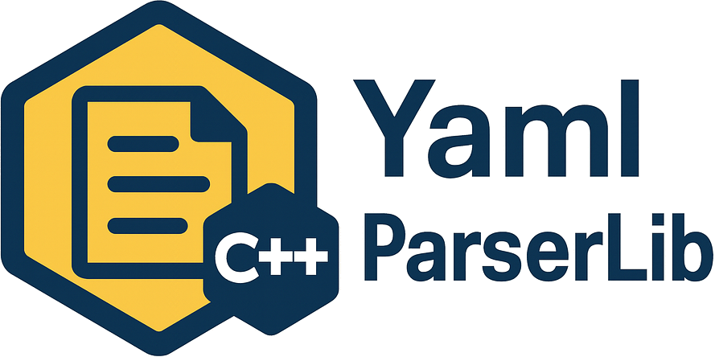


# YamlParserLib




A modern C++14 YAML parser library with CMake build, GoogleTest. Format code (optional):

## Table of Contents
- [Features](#features)
- [Requirements](#requirements)
- [Build and Test](#build-test-format--coverage)
- [Usage](#usage)
- [Sample Usage Examples](#sample-usage-examples)
- [Limitations](#limitations)
- [Contributing](#contributing)
- [License](#license)

## Features
- C++14 compatible (no third-party dependencies for YAML parsing)
- Full YAML 1.2 support:
  - Scalars (string, integer, float, boolean)
  - Sequences and mappings
  - Multiline strings (literal and folded)
  - Anchors and aliases
  - Merge keys
- Memory safety:
  - RAII design
  - Smart pointer management
  - Exception-safe error handling
- Development features:
  - GoogleTest-based unit tests
  - Code coverage reporting
  - LLVM-style clang-format integration
  - CMake-based build system
- Easy integration via CMake FetchContent or find_package

## Requirements
- C++14 compatible compiler (GCC 5+, Clang 3.4+, MSVC 2017+)
- CMake 3.14 or higher
- Optional tools:
  - clang-format (for code formatting)
  - lcov/genhtml (for coverage reports)
  - gcovr (for alternative coverage reports)
  - GoogleTest (automatically downloaded if not found)


## Build, Test, Format & Coverage

### Prerequisites Installation

#### Ubuntu/Debian
```sh
# Install build tools
sudo apt-get update
sudo apt-get install -y cmake g++ clang-format lcov gcovr

# Optional: Install latest CMake (if system version < 3.14)
sudo apt-get install -y wget
wget -qO- "https://cmake.org/files/v3.14/cmake-3.14.0-Linux-x86_64.tar.gz" | sudo tar --strip-components=1 -xz -C /usr/local
```

#### macOS
```sh
# Using Homebrew
brew install cmake llvm lcov gcovr
```

#### Windows
```powershell
# Using Chocolatey
choco install cmake llvm lcov gcovr
```

### Building the Library

1. Configure and build (unit tests enabled by default):
```sh
# Create build directory and configure
cmake -B build -S . -DENABLE_UNIT_TESTS=ON

# Build the library and tests
cmake --build build --config Release
```


### 2. Run tests
```sh
cd build
ctest
```
or
```sh
ctest --test-dir build
```

All YAML test files in `tests/` are automatically copied to the build directory for testing. CTest will discover and run each GoogleTest case individually.

To disable building and running unit tests:
```sh
cmake -DENABLE_UNIT_TESTS=OFF -S . -B build
cmake --build build
```

To clean up old test data:
```sh
rm -rf build/Testing
```


### 3. Code Formatting

The project uses **LLVM coding style** enforced by clang-format (see `.clang-format` configuration file).

To format all C++ source and header files in the project (`src`, `include`, `tests`, `limitation/sample_test`, `sample_usage/src`), run:

```sh
cmake --build build --target clang_format
```
This will apply clang-format to all relevant files in a single step. There is no need to run formatting in subdirectories.

**Key Style Features:**
- Based on LLVM style with 2-space indentation
- 120-character line limit
- Right-aligned pointers (`int *ptr`)
- Spaces instead of tabs
- Attached braces (`{` on same line)

### 4. Code Coverage

This project supports code coverage reporting using `lcov`, `genhtml`, and `gcovr` via CMake custom targets. To enable coverage reporting:

1. Configure CMake with coverage enabled:
   ```sh
   cmake -B build -S . -DENABLE_COVERAGE=ON
   ```

2. Build the project:
   ```sh
   cmake --build build
   ```

3. Generate coverage reports using one of these targets:

   - **Show coverage summary in console:**
     ```sh
     cmake --build build --target gcovr_console
     ```
   - **Generate HTML report with gcovr:**
     ```sh
     cmake --build build --target gcovr
     # View the report at build/coverage_gcovr.html
     ```
   - **Generate HTML report with lcov/genhtml:**
     ```sh
     cmake --build build --target coverage
     # View the report at build/coverage_report/index.html
     ```
   - **Upload to Codecov (requires internet):**
     ```sh
     cmake --build build --target codecov
     ```

> **Note:** To build and run tests without coverage overhead, configure CMake without the coverage flag:
> ```sh
> cmake -B build -S .
> ```

> **Note:** You need to have `lcov`, `genhtml`, and `gcovr` installed on your system to use these targets. If not found, CMake will print a warning.

## Usage

### CMake Integration

Add `yamlparser` as a library to your CMake project using one of these modern approaches:
#### Option 1: Using FetchContent (Recommended)

```cmake
include(FetchContent)
FetchContent_Declare(
    yamlparser
    GIT_REPOSITORY https://github.com/arabnejad/yamlparser.git
    GIT_TAG master  # or specific tag/commit
)
FetchContent_MakeAvailable(yamlparser)
target_link_libraries(your_target PRIVATE yamlparser)
```

#### Option 2: Using add_subdirectory (if using git submodule)

```cmake
add_subdirectory(third_party/yamlparser)
target_link_libraries(your_target PRIVATE yamlparser)
```

#### Option 3: Manual integration (copy source files)

```cmake
add_library(yamlparser STATIC
    yamlparser/src/YamlParser.cpp
    yamlparser/src/YamlElement.cpp
    yamlparser/src/YamlHelperFunctions.cpp
    yamlparser/src/YamlPrinter.cpp
)
target_include_directories(yamlparser PUBLIC yamlparser/include)
target_link_libraries(your_target PRIVATE yamlparser)
```

### Error Handling

The library uses **exception-based error handling** for robust error management. All exceptions inherit from `yamlparser::YamlException` and provide clear error messages:

```cpp
#include "YamlParser.hpp"
#include "YamlException.hpp"
using namespace yamlparser;

int main() {
    try {
        YamlParser parser;

        // File parsing throws exceptions on errors
        parser.parse("config.yaml");  // throws FileException if file not found

        // Safe access with automatic type and bounds checking
        if (parser.isSequenceRoot()) {
            const auto& sequence = parser.sequenceRoot();
            // Safe sequence access with bounds checking
            const auto& item = YamlElement::at(sequence, 0);  // throws IndexException if out of bounds
            std::cout << "First item: " << item.value.asString() << std::endl;  // throws TypeException if not string
        } else {
            const auto& config = parser.root();
            // Safe map access with key validation
            const auto& nameItem = YamlElement::at(config, "name");  // throws KeyException if key not found
            std::string name = nameItem.value.asString();  // throws TypeException if not string
            std::cout << "Name: " << name << std::endl;
        }

    } catch (const FileException& e) {
        std::cerr << "File error: " << e.what() << std::endl;
        return 1;
    } catch (const SyntaxException& e) {
        std::cerr << "YAML syntax error: " << e.what() << std::endl;
        return 1;
    } catch (const TypeException& e) {
        std::cerr << "Type error: " << e.what() << std::endl;
        return 1;
    } catch (const KeyException& e) {
        std::cerr << "Key error: " << e.what() << std::endl;
        return 1;
    } catch (const IndexException& e) {
        std::cerr << "Index error: " << e.what() << std::endl;
        return 1;
    } catch (const ConversionException& e) {
        std::cerr << "Conversion error: " << e.what() << std::endl;
        return 1;
    } catch (const StructureException& e) {
        std::cerr << "Structure error: " << e.what() << std::endl;
        return 1;
    } catch (const YamlException& e) {
        std::cerr << "YAML error: " << e.what() << std::endl;
        return 1;
    }

    return 0;
}
```

**Exception Types:**
- **`FileException`**: File cannot be opened, does not exist, or insufficient permissions
- **`SyntaxException`**: Invalid YAML syntax, malformed structures, or invalid indentation
- **`TypeException`**: Type mismatch when accessing values (e.g., calling `asInt()` on a string)
- **`KeyException`**: Accessing non-existent keys in mappings
- **`IndexException`**: Accessing out-of-bounds indices in sequences
- **`ConversionException`**: String-to-numeric conversion failures
- **`StructureException`**: Structure assumptions violated (e.g., expecting map but getting sequence)
- **`YamlException`**: Base class for all YAML-related exceptions

### Basic Example

```cpp
#include "YamlParser.hpp"
#include "YamlException.hpp"
using namespace yamlparser;

int main() {
    try {
        YamlParser parser;

        // Parse the YAML file (throws on error)
        parser.parse("config.yaml");

        // Check if root is a mapping (not a sequence)
        if (parser.isSequenceRoot()) {
            std::cerr << "Error: Expected root to be a map, but got sequence" << std::endl;
            return 1;
        }

        const auto& config = parser.root();

        // Safe access with exception throwing on missing keys
        const auto& nameItem = YamlElement::at(config, "name");
        std::string name = nameItem.value.asString();  // throws if not string
        std::cout << "Name: " << name << std::endl;

        // Check if key exists before accessing (optional pattern)
        if (config.count("items")) {
            const auto& itemsItem = YamlElement::at(config, "items");
            if (itemsItem.value.isSeq()) {
                const auto& items = itemsItem.value.asSeq();
                for (size_t i = 0; i < items.size(); ++i) {
                    const auto& item = YamlElement::at(items, i);
                    if (item.value.isString()) {
                        std::cout << "Item: " << item.value.asString() << std::endl;
                    }
                }
            }
        }

    } catch (const YamlException& e) {
        std::cerr << "YAML Error: " << e.what() << std::endl;
        return 1;
    }

    return 0;
}
```

### YAML Features Example

```yaml
# config.yaml
name: Test Config
version: 1.0
enabled: true
timeout: 30

# Sequence example
items:
  - first
  - second
  - third

# Mapping example
database:
  host: localhost
  port: 5432
  credentials:
    username: admin
    password: secret

# Anchor and alias example
defaults: &defaults
  retries: 3
  timeout: 5000

service1:
  <<: *defaults  # Merge key
  host: service1.example.com

service2:
  <<: *defaults  # Reuse defaults
  host: service2.example.com

# Multiline string example
description: |
  This is a multi-line
  description that preserves
  newlines and formatting.
```

### Advanced Examples

#### 1. Working with Complex Nested Structures
```cpp
#include "YamlParser.hpp"
#include <iostream>
using namespace yamlparser;

int main() {
    YamlParser parser;
    parser.parse("nested_config.yaml");
    const auto& config = parser.root();
    if (config.count("database") && config.at("database").value.isMap()) {
        const auto& db = config.at("database").value.asMap();
        if (db.count("pool") && db.at("pool").value.isMap()) {
            const auto& pool = db.at("pool").value.asMap();
            int maxSize = pool.at("max_size").value.asInt();
            int timeout = pool.at("timeout").value.asInt();
            std::cout << "DB Pool: max_size=" << maxSize << ", timeout=" << timeout << std::endl;
        }
        if (db.count("replicas") && db.at("replicas").value.isSeq()) {
            const auto& replicas = db.at("replicas").value.asSeq();
            for (const auto& replica : replicas) {
                const auto& replicaMap = replica.value.asMap();
                std::string host = replicaMap.at("host").value.asString();
                int port = replicaMap.at("port").value.asInt();
                std::cout << "Replica: " << host << ":" << port << std::endl;
            }
        }
    }
    return 0;
}
```

```yaml
# nested_config.yaml
database:
  host: primary.example.com
  port: 5432
  pool:
    max_size: 20
    timeout: 30
    idle_timeout: 300
  replicas:
    - host: replica1.example.com
      port: 5432
      priority: 1
    - host: replica2.example.com
      port: 5432
      priority: 2
  credentials:
    username: admin
    password: secret
```

#### 2. Working with Arrays and Custom Types
```cpp
#include "YamlParser.hpp"
#include <vector>
#include <string>
#include <iostream>
using namespace yamlparser;

struct ServerConfig {
    std::string host;
    int port;
    bool ssl;
    std::vector<std::string> allowed_origins;
};

ServerConfig parseServerConfig(const YamlElement& elem) {
    ServerConfig config;
    const auto& map = elem.asMap();
    config.host = map.at("host").value.asString();
    config.port = map.at("port").value.asInt();
    config.ssl = map.at("ssl").value.asBool();
    const auto& origins = map.at("allowed_origins").value.asSeq();
    for (const auto& origin : origins) {
        config.allowed_origins.push_back(origin.value.asString());
    }
    return config;
}

int main() {
    YamlParser parser;
    parser.parse("server_config.yaml");
    const auto& root = parser.root();
    if (root.count("server")) {
        const auto& serverElem = root.at("server").value;
        ServerConfig config = parseServerConfig(serverElem);
        std::cout << "Host: " << config.host << "\nPort: " << config.port << "\nSSL: " << (config.ssl ? "true" : "false") << std::endl;
        std::cout << "Allowed origins:";
        for (const auto& origin : config.allowed_origins) {
            std::cout << "\n  - " << origin;
        }
        std::cout << std::endl;
    }
    return 0;
}
```

```yaml
# server_config.yaml
server:
  host: localhost
  port: 8080
  ssl: true
  allowed_origins:
    - https://example.com
    - https://api.example.com
    - https://admin.example.com
```

#### 3. Using Anchors and References
```cpp
#include "YamlParser.hpp"
#include <iostream>
using namespace yamlparser;

int main() {
    YamlParser parser;
    parser.parse("services_config.yaml");
    const auto& config = parser.root();
    const auto& services = config.at("services").value.asMap();
    for (auto it = services.begin(); it != services.end(); ++it) {
        const std::string& name = it->first;
        const auto& service = it->second;
        const auto& serviceConfig = service.value.asMap();
        int timeout = serviceConfig.at("timeout").value.asInt();
        int retries = serviceConfig.at("retries").value.asInt();
        std::string url = serviceConfig.at("url").value.asString();
        std::cout << "Service: " << name << "\n  URL: " << url << "\n  Timeout: " << timeout << "\n  Retries: " << retries << std::endl;
    }
    return 0;
}
```

```yaml
# services_config.yaml
# Define common settings using an anchor
common: &default_settings
  timeout: 30
  retries: 3
  retry_delay: 5

services:
  auth_service:
    <<: *default_settings  # Merge default settings
    url: https://auth.example.com
    timeout: 10  # Override default timeout

  payment_service:
    <<: *default_settings  # Merge default settings
    url: https://payments.example.com

  notification_service:
    <<: *default_settings  # Merge default settings
    url: https://notifications.example.com
    retries: 5  # Override default retries
```

#### 4. Error Handling and Validation
```cpp
#include "YamlParser.hpp"
#include <iostream>
#include <memory>
using namespace yamlparser;

struct DatabaseConfig {
    std::string host;
    int port;
    std::string username;
    std::string password;
    int* timeout; // nullptr if not set
    DatabaseConfig() : port(0), timeout(nullptr) {}
    ~DatabaseConfig() { if (timeout) delete timeout; }
};

DatabaseConfig* parseDatabaseConfig(const std::string& filename) {
    try {
        YamlParser parser;
        parser.parse(filename);
        const auto& config = parser.root();
        DatabaseConfig* db = new DatabaseConfig();
        if (!config.count("host") || !config.at("host").value.isString()) {
            throw std::runtime_error("Missing or invalid 'host' field");
        }
        db->host = config.at("host").value.asString();
        if (!config.count("port") || !config.at("port").value.isInt()) {
            throw std::runtime_error("Missing or invalid 'port' field");
        }
        db->port = config.at("port").value.asInt();
        if (config.count("timeout") && config.at("timeout").value.isInt()) {
            db->timeout = new int(config.at("timeout").value.asInt());
        }
        return db;
    } catch (const std::exception& e) {
        std::cerr << "Failed to parse database config: " << e.what() << std::endl;
        return nullptr;
    }
}

int main() {
    DatabaseConfig* db = parseDatabaseConfig("db_config.yaml");
    if (db) {
        std::cout << "Host: " << db->host << "\nPort: " << db->port << std::endl;
        if (db->timeout) {
            std::cout << "Timeout: " << *(db->timeout) << std::endl;
        }
        delete db;
    }
    return 0;
}
```

#### 5. Working with Arrays and Mixed Types
```cpp
#include <YamlParser.hpp>
#include <vector>
#include <iostream>

void processArrays() {
    YamlParser parser;
    auto doc = parser.parseFile("arrays.yaml");

    const auto& config = doc.asMap();

    // Simple integer array
    if (config.count("numbers") && config.at("numbers").value.isSeq()) {
        const auto& numbers = config.at("numbers").value.asSeq();
        std::cout << "Numbers: ";
        for (const auto& num : numbers) {
            if (num.value.isInt()) {
                std::cout << num.value.asInt() << " ";
            }
        }
        std::cout << std::endl;
    }

    // String array
    if (config.count("fruits") && config.at("fruits").value.isSeq()) {
        const auto& fruits = config.at("fruits").value.asSeq();
        std::cout << "Fruits: ";
        for (const auto& fruit : fruits) {
            if (fruit.value.isString()) {
                std::cout << fruit.value.asString() << " ";
            }
        }
        std::cout << std::endl;
    }

    // Mixed type array
    if (config.count("mixed") && config.at("mixed").value.isSeq()) {
        const auto& mixed = config.at("mixed").value.asSeq();
        std::cout << "Mixed values: ";
        for (const auto& item : mixed) {
            if (item.value.isString()) {
                std::cout << "\"" << item.value.asString() << "\" ";
            } else if (item.value.isInt()) {
                std::cout << item.value.asInt() << " ";
            } else if (item.value.isBool()) {
                std::cout << (item.value.asBool() ? "true" : "false") << " ";
            }
        }
        std::cout << std::endl;
    }

    // Array of objects
    if (config.count("users") && config.at("users").value.isSeq()) {
        const auto& users = config.at("users").value.asSeq();
        for (const auto& user : users) {
            if (user.value.isMap()) {
                const auto& userMap = user.value.asMap();
                std::string name = userMap.at("name").value.asString();
                int age = userMap.at("age").value.asInt();
                bool active = userMap.at("active").value.asBool();

                std::cout << "User: " << name
                         << ", Age: " << age
                         << ", Active: " << (active ? "yes" : "no")
                         << std::endl;
            }
        }
    }

    // Nested arrays
    if (config.count("matrix") && config.at("matrix").value.isSeq()) {
        const auto& matrix = config.at("matrix").value.asSeq();
        std::cout << "Matrix:" << std::endl;
        for (const auto& row : matrix) {
            if (row.value.isSeq()) {
                const auto& rowSeq = row.value.asSeq();
                for (const auto& cell : rowSeq) {
                    if (cell.value.isInt()) {
                        std::cout << cell.value.asInt() << " ";
                    }
                }
                std::cout << std::endl;
            }
        }
    }
}
```

```yaml
# arrays.yaml
# Simple integer array
numbers: [1, 2, 3, 4, 5]

# Alternative array syntax
numbers_alt:
  - 1
  - 2
  - 3
  - 4
  - 5

# String array
fruits:
  - apple
  - banana
  - orange
  - grape

# Mixed type array
mixed: [42, "hello", true, "world", false, 123]

# Array of objects
users:
  - name: John
    age: 30
    active: true
  - name: Alice
    age: 25
    active: false
  - name: Bob
    age: 35
    active: true

# Nested arrays (matrix)
matrix:
  - [1, 2, 3]
  - [4, 5, 6]
  - [7, 8, 9]

# Array with flow style and complex types
settings:
  ports: [8080, 8081, 8082]
  flags: [true, false, true]
  names: ["server1", "server2", "server3"]
  coordinates: [[0, 0], [1, 1], [2, 2]]
```

#### 6. Helper Functions for Array Processing
```cpp
#include "YamlParser.hpp"
#include <vector>
#include <iostream>
using namespace yamlparser;

std::vector<int> toVectorInt(const YamlSeq& seq) {
    std::vector<int> result;
    result.reserve(seq.size());
    for (const auto& item : seq) {
        if (item.value.isInt()) {
            result.push_back(item.value.asInt());
        }
    }
    return result;
}

std::vector<std::string> toVectorString(const YamlSeq& seq) {
    std::vector<std::string> result;
    result.reserve(seq.size());
    for (const auto& item : seq) {
        if (item.value.isString()) {
            result.push_back(item.value.asString());
        }
    }
    return result;
}

std::vector<bool> toVectorBool(const YamlSeq& seq) {
    std::vector<bool> result;
    result.reserve(seq.size());
    for (const auto& item : seq) {
        if (item.value.isBool()) {
            result.push_back(item.value.asBool());
        }
    }
    return result;
}

int main() {
    YamlParser parser;
    parser.parse("arrays.yaml");
    const auto& config = parser.root();
    if (config.count("numbers") && config.at("numbers").value.isSeq()) {
        std::vector<int> numbers = toVectorInt(config.at("numbers").value.asSeq());
        std::cout << "Numbers vector size: " << numbers.size() << std::endl;
    }
    if (config.count("fruits") && config.at("fruits").value.isSeq()) {
        std::vector<std::string> fruits = toVectorString(config.at("fruits").value.asSeq());
        std::cout << "Fruits vector size: " << fruits.size() << std::endl;
    }
    if (config.count("settings") && config.at("settings").value.isMap()) {
        const auto& settings = config.at("settings").value.asMap();
        if (settings.count("flags") && settings.at("flags").value.isSeq()) {
            std::vector<bool> flags = toVectorBool(settings.at("flags").value.asSeq());
            std::cout << "Flags vector size: " << flags.size() << std::endl;
        }
    }
    return 0;
}
```

## Sample Usage Examples

For practical examples demonstrating how to use the YAML Parser library in real-world scenarios, see the **[Sample Usage Examples](./sample_usage/README.md)**.

The sample usage folder contains **10+ complete working examples** with both C++ source code and corresponding YAML files:

### Available Examples:
- **[Basic Configuration](./sample_usage/src/basic_config.cpp)** - Simple key-value parsing
- **[Nested Structures](./sample_usage/src/nested_structures.cpp)** - Deep hierarchical navigation
- **[Arrays & Sequences](./sample_usage/src/arrays_sequences.cpp)** - Array processing techniques
- **[Anchors & Merge Keys](./sample_usage/src/anchors_merge.cpp)** - Reference and merge syntax (with limitations)
- **[Nested Maps](./sample_usage/src/nested_maps.cpp)** - Complex map navigation
- **[Multiline Strings](./sample_usage/src/multiline_strings.cpp)** - Text handling (with limitations)
- **[Data Types](./sample_usage/src/data_types.cpp)** - Various YAML types and type detection
- **[Application Configuration](./sample_usage/src/app_config.cpp)** - Real-world app config parsing
- **[Complex Data Structures](./sample_usage/src/complex_data.cpp)** - Advanced nested data handling
- **[Nested Arrays](./sample_usage/src/nested_arrays.cpp)** - Multi-dimensional array processing

### Quick Start with Samples:
```bash
# Build and run all examples
cd sample_usage
cmake -S . -B build
cmake --build build --target run_all_samples

# Or run individual examples
./build/bin/basic_config
./build/bin/nested_structures
# ... etc
```

Each example is fully documented and demonstrates best practices for:
- Safe type checking and value extraction
- Error handling patterns
- Real-world usage scenarios

## Limitations

The YAML parser has some known limitations that affect certain YAML constructs. For detailed documentation and test cases demonstrating these limitations, see the **[Limitation Documentation](@ref limitation_doc)**.

### Key Limitations Summary (6 confirmed limitations):
- **Merge Keys with Inline Comments**: Inline comments break merge functionality
- **Nested Sequences**: Sequences within sequences become empty maps
- **String Escape Sequences**: Escape sequences kept literal, not processed
- **Boolean Recognition**: Only lowercase `true`/`false` recognized
- **Scientific Notation**: Parsed as strings, not numbers
- **Empty Values**: Treated as empty strings rather than nulls

### Testing Limitations
To test and verify these limitations yourself:
```bash
cd limitation/
cmake . && make
./run_all_tests.sh
```

Each limitation has dedicated test cases with workarounds and detailed explanations. See [limitation/limitation.md](./limitation/limitation.md) for documentation.

## Contributing

Contributions are welcome! Please feel free to submit a Pull Request. For major changes, please open an issue first to discuss what you would like to change.

Please ensure that your contributions:
1. Follow the existing code style (run clang-format)
2. Add/update unit tests as needed
3. Update documentation for new features
4. Maintain or improve code coverage

### Development Workflow
1. Fork the repository
2. Create your feature branch (`git checkout -b feature/amazing-feature`)
3. Format your changes (`cmake --build build --target clang_format`)
4. Commit your changes (`git commit -m 'Add amazing feature'`)
5. Push to the branch (`git push origin feature/amazing-feature`)
6. Open a Pull Request

## License

This project is licensed under the MIT License - see the [LICENSE](LICENSE) file for details.
